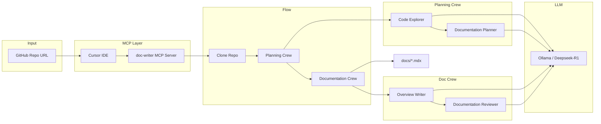

# Documentation Writer Flow

Automated documentation generation for codebases using multi-agent AI (CrewAI + Deepseek-R1) and MCP.

---

## 1. The Problem

- **What problem does this solve?**  
  Writing and keeping docs in sync with code is slow and often skipped. Many repos end up with outdated or missing docs, which slows onboarding and increases support load.

- **Who has this problem?**  
  Dev teams (especially small ones), open-source maintainers, and anyone shipping code that others need to understand. Technical writers and developer advocates who need to document many repos also benefit.

- **How much does it cost them?**  
  Manual doc work can take hours per repo (reading code, drafting, reviewing). Outdated docs lead to wrong assumptions, more bugs, and slower contributions. For teams, this often means 10–20% of “documentation time” lost to busywork that could be automated.

---

## 2. The Solution

### High-level architecture



**Pipeline summary:** User sends a repo URL via Cursor → MCP server runs the flow → repo is cloned → Planning Crew (Code Explorer + Documentation Planner) analyzes the codebase and produces a doc plan → Documentation Crew (Overview Writer + Reviewer) drafts and reviews docs → output is written to `docs/*.mdx`.

### Tech stack (and why)

| Component | Choice | Why |
|-----------|--------|-----|
| **Orchestration** | CrewAI | Multi-agent workflows, clear task/agent split, good for “plan then write” pipelines. |
| **LLM** | Deepseek-R1 (via Ollama) | Strong reasoning, runs locally for privacy and cost control. |
| **Serving** | Ollama | Simple local API, one command to run the model. |
| **Host** | Cursor IDE | Native MCP support; docs can be triggered and viewed inside the editor. |
| **Protocol** | MCP (FastMCP, SSE) | Standard way to expose tools to Cursor and other MCP clients. |
| **Config** | YAML (agents/tasks) | Easy to tune prompts and behavior without touching Python. |

### Key features

- **One URL in, docs out:** Pass a GitHub repo URL; get structured docs (overview, guides) in `docs/`.
- **Multi-agent pipeline:** Separate agents for exploring code, planning docs, writing, and reviewing (with Mermaid syntax checks).
- **Local-first:** Model runs via Ollama; no need to send code to external APIs.
- **IDE-integrated:** MCP tools (`write_documentation`, `list_docs`, `view_content`) usable from Cursor chat.
- **Structured output:** Plan and docs follow defined schemas (e.g. Pydantic `DocPlan`); output is `.mdx` for use in doc sites.

---

## 3. The Results

- **Business-style metrics (examples):**  
  - Time to first draft: from hours to minutes per repo.  
  - Consistent structure across projects (same doc types and flow).  
  - Fewer “no docs” repos when automation is in the loop.

- **Technical metrics (examples):**  
  - Single flow run: clone → plan → write → review for a small/medium repo.  
  - Output: multiple `.mdx` files under `docs/` (overview, guides, etc.).  
  - Guardrails: Mermaid blocks validated/corrected before final write.

- **User testimonials:**  
  *(Placeholder — add short quotes from users or internal teams once you have them.)*

---

## 4. Technical Deep Dive

### Data pipeline

1. **Input:** GitHub repo URL (e.g. `https://github.com/org/repo`).
2. **Clone:** Repo is cloned into `workdir/<repo_name>` (existing dir is removed first).
3. **Planning:** Code Explorer scans the repo (DirectoryReadTool, FileReadTool); Documentation Planner produces a structured plan (overview + list of doc entries with title, description, prerequisites, examples, goal). Plan is stored as `docs/plan.json`.
4. **Documentation:** For each planned doc, Overview Writer drafts content (with optional web search for Mermaid syntax); Documentation Reviewer checks quality and Mermaid syntax (with retries). Each doc is written to `docs/<title>.mdx`.
5. **Output:** `docs/*.mdx` plus `docs/plan.json`; MCP tools expose listing and viewing of these files.

### Model approach and why

- **Deepseek-R1:** Used for planning and writing. Good at following instructions and producing structured text; fits “analyze then document” workflows.
- **Ollama:** Same API as OpenAI-style clients; easy swap of model or base URL. Running locally avoids sending code off-machine.
- **Structured output:** Planning uses Pydantic (`DocPlan`) so the rest of the pipeline gets a fixed schema (overview, list of docs with fields). Reduces parsing errors and keeps doc generation deterministic per plan.

### Deployment setup

- **Requirements:** Python 3.12+, Ollama with Deepseek-R1 (e.g. `ollama pull deepseek-r1`), Git.
- **Install:** `pip install crewai crewai-tools ollama mcp` (or `uv sync` from project root).
- **Run server:** `python server.py` → MCP server listens on `http://127.0.0.1:8000` (SSE at `http://127.0.0.1:8000/sse`).
- **Cursor:** Add MCP server with URL `http://127.0.0.1:8000/sse` and toggle it on. No separate “deploy” step for local use.

### Monitoring strategy

- **Observability:** Today: console logs (e.g. “Cloning repository…”, “Creating documentation for: …”). Optional next steps: structured logging (JSON), metrics (run duration, success/failure per repo), or health endpoint for the MCP server.
- **Failure handling:** Invalid repo URL or clone errors surface as tool errors to the user. Documentation Crew uses a Mermaid guardrail with retries (e.g. `max_retries=5`) to correct syntax before saving.

---

## 5. Learnings & Trade-offs

- **What worked:**  
  - YAML config for agents/tasks made prompt and role changes fast.  
  - Two-stage flow (plan → write) kept outputs consistent and avoid “one big prompt” mess.  
  - MCP + Cursor made it possible to trigger and inspect docs without leaving the IDE.  
  - Local Ollama + Deepseek-R1 gave good quality without cloud dependency.

- **What didn’t:**  
  - Very large repos can make planning/writing slow or hit context limits; better chunking or “docs for subset of repo” would help.  
  - Mermaid fixes are heuristic (e.g. `|>` replacements); a real Mermaid parser would be more robust.  
  - Single LLM for all agents is simpler but limits specializing (e.g. “reviewer-only” model).

- **What we’d do differently:**  
  - Add optional “doc scope” (e.g. only `src/` or only public API) to reduce noise and token use.  
  - Cache or reuse plan when only small code changes.  
  - Consider a small “docs health” check (e.g. broken links, outdated snippets) in the reviewer agent.

---

## 6. Try It

### Live demo

*(Add a link here if you host a demo instance or a video walkthrough.)*

### Setup instructions

**1. Install Ollama and pull the model**

- Windows/macOS: install from [ollama.com](https://ollama.com).  
- Linux: `curl -fsSL https://ollama.com/install.sh | sh`  
- Then: `ollama pull deepseek-r1`

**2. Install Python dependencies (3.12+)**

```bash
pip install crewai crewai-tools ollama mcp
# or: uv sync
```

**3. Configure MCP in Cursor**

- Settings → MCP → add a global MCP server.  
- Config:

```json
{
    "mcpServers": {
        "doc-writer": {
            "url": "http://127.0.0.1:8000/sse"
        }
    }
}
```

**4. Start the server**

```bash
cd path/to/documentation-writer-flow
python server.py
```

**5. Connect in Cursor**

- Settings → MCP → turn **doc-writer** ON.

**6. Use it**

- In Cursor chat: ask to generate documentation and provide a GitHub repo URL.  
- Then use the tools to list or view generated docs.

### API (MCP tools)

| Tool | Args | Description |
|------|------|-------------|
| `write_documentation` | `repo_url: str` | Generates documentation for the given GitHub repo URL. Returns a success or error message. |
| `list_docs` | — | Lists generated `.mdx` files under `docs/`. |
| `view_content` | `file_path: str` | Returns the content of a generated doc (e.g. `docs/overview.mdx`). Path must be under `docs/` and use `.mdx` or `.md`. |

---

*Repository: [Writer-Flow-Deepseek-r1](https://github.com/satyammistari/Writer-Flow-Deepseek-r1)*
